  

  

  
  
  

  

### About me

- Junior developer who likes owning the whole path: database, API, UI and sometimes the hardware.
- Most at home with **Python** (FastAPI · Django · PySide6) and **JS/TS** (Next.js · React · Node.js).
- I enjoy the plumbing too: microservices, message queues, Docker and SQL.
- Currently learning **Flutter**, **ComfyUI** and self-hosting on my own **VPS**.
- Connecting from Mars, so my ping is a little high.

### Hakkımda

- İşin tamamını üstlenmeyi seven junior bir geliştiriciyim: veritabanı, API, arayüz, bazen de donanım.
- En rahat ettiğim yerler **Python** (FastAPI · Django · PySide6) ve **JS/TS** (Next.js · React · Node.js).
- İşin altyapı kısmını da seviyorum: mikroservisler, mesaj kuyrukları, Docker ve SQL.
- Şu sıralar **Flutter**, **ComfyUI** ve kendi **VPS**'imde site barındırmayı öğreniyorum.
- Mars'tan bağlanıyorum, ping biraz yüksek olabilir.

  

## Tech Stack · Teknolojiler

  

  

## Featured Projects · Öne Çıkan Projeler

**[SSO-System](https://github.com/oguz-hd/SSO-System)** 
University SSO and information platform on a microservice architecture: role-based access matrix, live audit logs, internship portal and a RAG-powered AI assistant. 
Mikroservis mimarili üniversite SSO ve bilgi platformu: rol bazlı yetki matrisi, canlı loglar, staj portalı ve RAG destekli yapay zeka asistanı. 
`Next.js` `FastAPI` `RabbitMQ` `PostgreSQL` `Redis` `Docker`

**[restart-rooter](https://github.com/oguz-hd/restart-rooter)** 
One-click (or fully automatic) modem reboot. Replays the router's RSA-encrypted login flow and keeps the password safe with Windows DPAPI. 
Tek tıkla ya da tamamen otomatik modem yeniden başlatıcı. Modemin RSA şifreli giriş akışını taklit eder, şifreyi Windows DPAPI ile saklar. 
`PowerShell`

**[Smart Parking](https://github.com/oguz-hd/smartParkingSystemwithFirebase)** 
ESP32 and ultrasonic sensors count cars in real time, sync to Firebase and drive a live web dashboard with LCD and buzzer alerts. 
ESP32 ve ultrasonik sensörlerle anlık araç sayımı; Firebase senkronizasyonu, canlı web paneli, LCD ve buzzer uyarıları. 
`ESP32` `Firebase` `JavaScript`

**[anka-llm](https://github.com/oguz-hd/anka-llm)** 
Gemini-powered AI chat assistant with a React client and a Node.js server. 
React istemcisi ve Node.js sunucusuyla Gemini tabanlı yapay zeka asistanı. 
`React` `Node.js` `Gemini API`

**[Ege Emlak](https://github.com/oguz-hd/realEstateAgentWebsite)** 
Real estate automation: a FastAPI REST API with image upload, on top of a normalized SQL Server database. 
Emlak otomasyonu: normalize edilmiş SQL Server veritabanı üzerinde, görsel yüklemeli FastAPI REST API. 
`FastAPI` `Python` `SQL Server`

**505letter** · [basic](https://github.com/oguz-hd/505letter-basic) · [Django](https://github.com/oguz-hd/505letter-djangoo) · [React](https://github.com/oguz-hd/505letter-react) 
The same movie collection and rating app, built three times with three different stacks. 
Aynı film arşivi ve puanlama uygulaması, üç farklı teknolojiyle üç kez. 
`HTML` `Django` `React`

**Qt apps** · [orders](https://github.com/oguz-hd/orderManagementSystemwithQT) · [car rental](https://github.com/oguz-hd/carRentalManagementSystemwithQT) 
PySide6 desktop apps for restaurant orders and car rentals. 
Restoran siparişleri ve araç kiralama için PySide6 masaüstü uygulamaları. 
`Python` `Qt` `PySide6`

I also write beginner guides: [Markdown](https://github.com/oguz-hd/use-of-mark-down) and [YAML for Docker](https://github.com/oguz-hd/use-of-yaml-docker). 
Yeni başlayanlar için rehberler de yazıyorum: Markdown ve Docker için YAML. 

  

## GitHub Stats · İstatistikler

  
  

  

  <picture>
    <source media="(prefers-color-scheme: dark)" srcset="https://raw.githubusercontent.com/oguz-hd/oguz-hd/main/profile/snake-dark.svg" />
    <source media="(prefers-color-scheme: light)" srcset="https://raw.githubusercontent.com/oguz-hd/oguz-hd/main/profile/snake.svg" />
    
  </picture>

  

